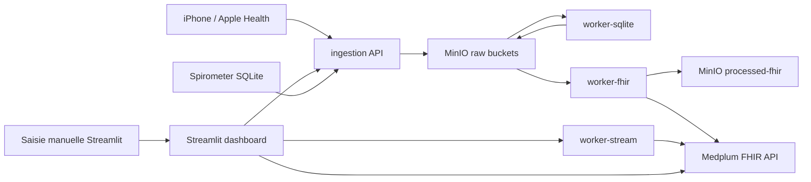
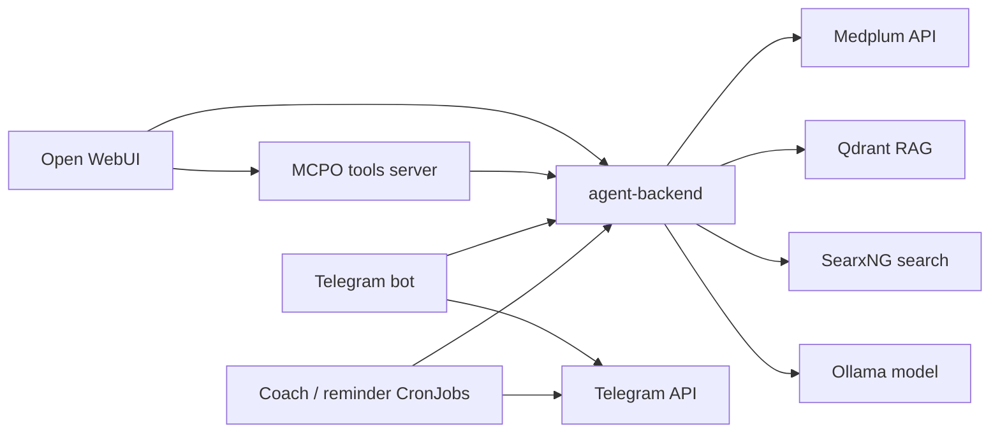
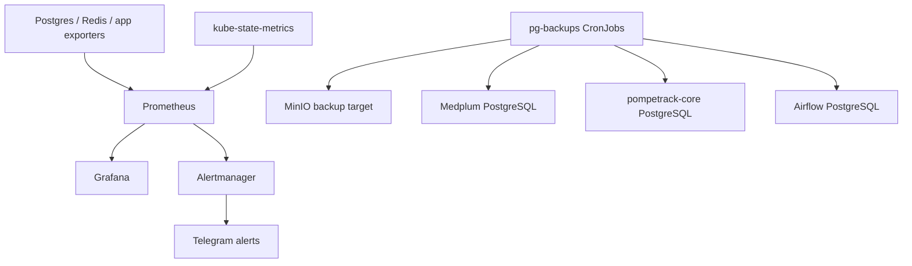

# Architecture Cluster PompeTrack K3s

Ce document donne une vue globale Mermaid du cluster. Les details par couche sont separes dans:

- `docs/Archi_flux_1.md` pour les routes HTTP entrantes;
- `docs/Archi_flux_2.md` pour les NetworkPolicies;
- `docs/Archi_flux_3.md` pour Istio;
- `docs/routage.md` pour le routage detaille;
- `docs/tips.md` pour les commandes de debug.

## Vue Globale

```mermaid
flowchart TB
  user["Utilisateur navigateur"]
  phone["iPhone / Apple Health"]
  integrations["Integrations externes"]
  telegram_user["Utilisateur Telegram"]
  ollama["Ollama LAN / externe"]
  internet["Internet APIs"]
  yunohost["Yunohost / nginx\nTLS + reverse proxy"]

  subgraph cluster["K3s - 192.168.2.88"]
    direction TB

    subgraph edge["kube-system"]
      traefik["Traefik\nLoadBalancer\nweb:80 / websecure:443"]
      coredns["kube-dns"]
    end

    subgraph mesh["istio-system"]
      istiod["istiod\nsidecar injection + xDS"]
    end

    subgraph storage["nfs-provisioner"]
      nfs["Dynamic PV provisioning"]
    end

    subgraph core["pompetrack-core"]
      ingestion["ingestion\nAPI imports"]
      streamlit["streamlit\nhealth dashboard"]
      worker_fhir["worker-fhir\nFHIR transformation"]
      worker_sqlite["worker-sqlite\nspirometer DB processing"]
      worker_stream["worker-stream\nFHIR query bridge"]
      minio["MinIO\nraw + processed buckets"]
      core_pg["PostgreSQL\npompetrack"]
    end

    subgraph med["medplum"]
      med_app["medplum-app\nweb UI"]
      med_api["medplum API"]
      med_provider["medplum-provider"]
      med_pg["PostgreSQL\nMedplum"]
      med_redis["Redis"]
      med_exporters["Postgres / Redis exporters"]
    end

    subgraph airflow["airflow"]
      airflow_api["airflow-api-server"]
      airflow_sched["scheduler"]
      airflow_dag["dag-processor"]
      airflow_pg["PostgreSQL\nAirflow"]
    end

    subgraph llm["llm-agent"]
      openwebui["Open WebUI"]
      agent_backend["agent-backend\nOpenAI-compatible API"]
      mcpo["agent-backend-mcpo\nOpenAPI tools"]
      searxng["SearxNG"]
      qdrant["Qdrant"]
      telegram_bot["telegram-health-bot"]
      reminder_runner["telegram-reminder-runner\nCronJob"]
      coach_jobs["health coach CronJobs"]
      agent_ui["streamlit-agent-llm"]
    end

    subgraph monitoring["monitoring"]
      prometheus["Prometheus"]
      grafana["Grafana"]
      alertmanager["Alertmanager"]
      kube_state["kube-state-metrics"]
      prom_operator["Prometheus Operator"]
    end

    subgraph backups["pg-backups"]
      backup_jobs["backup-db1/db2/db3\nCronJobs"]
    end
  end

  user -->|"HTTPS public"| yunohost --> traefik
  user -->|"HTTP LAN .lan / nip.io"| traefik
  phone -->|"imports"| traefik
  integrations -->|"ingestion APIs"| traefik
  telegram_user -->|"Telegram Bot API"| internet

  traefik --> med_app
  traefik --> med_api
  traefik --> med_provider
  traefik --> streamlit
  traefik --> ingestion
  traefik --> minio
  traefik --> airflow_api
  traefik --> grafana
  traefik --> prometheus
  traefik --> openwebui
  traefik --> agent_backend
  traefik --> mcpo
  traefik --> agent_ui

  ingestion --> minio
  ingestion --> med_api
  streamlit --> worker_stream
  streamlit --> med_api
  worker_stream --> med_api
  worker_fhir --> minio
  worker_fhir --> med_api
  worker_sqlite --> minio
  worker_sqlite --> med_api
  core_pg --- streamlit

  med_app --> med_api
  med_provider --> med_api
  med_api --> med_pg
  med_api --> med_redis

  airflow_sched --> ingestion
  airflow_sched --> minio
  airflow_sched --> med_api
  airflow_api --> airflow_pg
  airflow_sched --> airflow_pg
  airflow_dag --> airflow_pg

  openwebui --> agent_backend
  openwebui --> mcpo
  agent_backend --> med_api
  agent_backend --> qdrant
  agent_backend --> searxng
  agent_backend --> ollama
  mcpo --> agent_backend
  telegram_bot --> agent_backend
  reminder_runner --> agent_backend
  coach_jobs --> agent_backend
  telegram_bot --> internet
  reminder_runner --> internet
  searxng --> internet

  prometheus --> med_exporters
  prometheus --> core_pg
  prometheus --> airflow_pg
  prometheus --> kube_state
  prometheus --> alertmanager
  grafana --> prometheus
  alertmanager --> internet
  prom_operator --> prometheus

  backup_jobs --> med_pg
  backup_jobs --> core_pg
  backup_jobs --> airflow_pg
  backup_jobs --> minio

  med_pg --- nfs
  core_pg --- nfs
  airflow_pg --- nfs
  minio --- nfs
  qdrant --- nfs
  openwebui --- nfs

  istiod -. "sidecar config" .-> core
  istiod -. "sidecar config" .-> med
  istiod -. "sidecar config" .-> airflow
  istiod -. "sidecar config" .-> llm
  istiod -. "sidecar config" .-> monitoring

  core -. "DNS" .-> coredns
  med -. "DNS" .-> coredns
  airflow -. "DNS" .-> coredns
  llm -. "DNS" .-> coredns
  monitoring -. "DNS" .-> coredns
  backups -. "DNS" .-> coredns
```

## Pipeline Donnees Sante

## Pipeline LLM Coach

## Observabilite Et Sauvegardes

