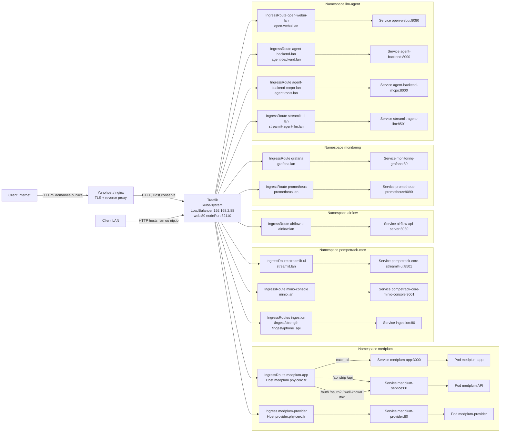
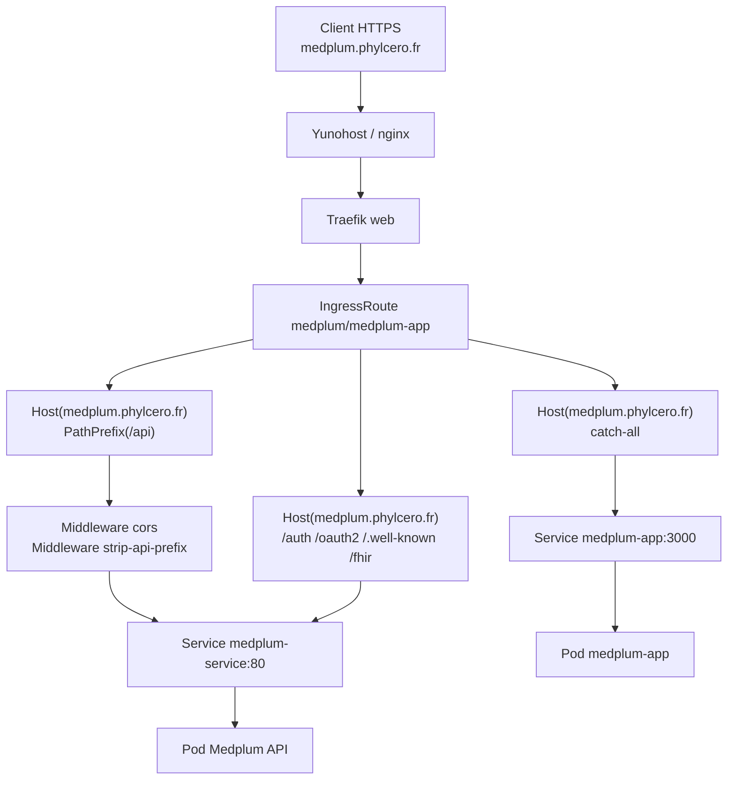
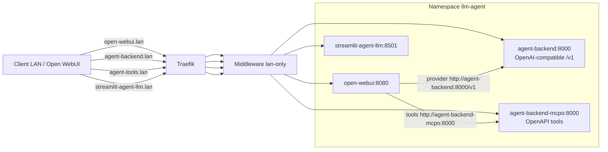

# Architecture Flux 1 - Routes HTTP Entrantes

Ce fichier donne une vue Mermaid des flux north-south: navigateur ou integration externe vers Traefik, puis vers les Services Kubernetes.

Pour les commandes de debug et les details de chaque host, voir `docs/routage.md` et `docs/tips.md`.

## Vue Globale

## Zoom Medplum

## Zoom llm-agent

