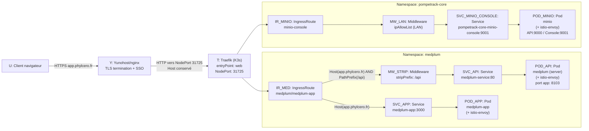
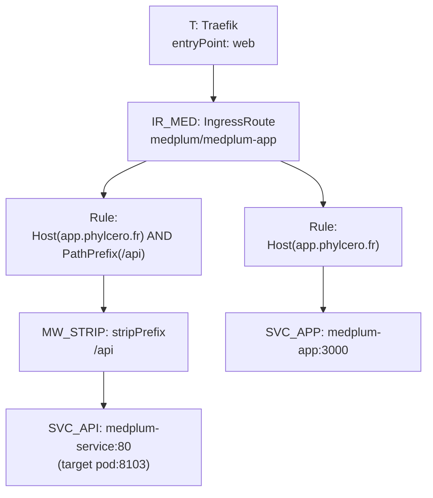

# Page 1 — Architecture & flux

## Légende (commune)

* **U** : client (navigateur)
* **Y** : Yunohost/nginx (TLS termination + SSO)
* **T** : Traefik (K3s, entryPoint `web`, NodePort `31725`)
* **IR_*** : IngressRoute Traefik
* **MW_*** : Middleware Traefik
* **SVC_*** : Service Kubernetes
* **POD_*** : Pod (souvent avec sidecar Istio)

## Diagramme A — Vue d’ensemble (routes HTTP)

## Diagramme B — Zoom Traefik (Medplum)

---
