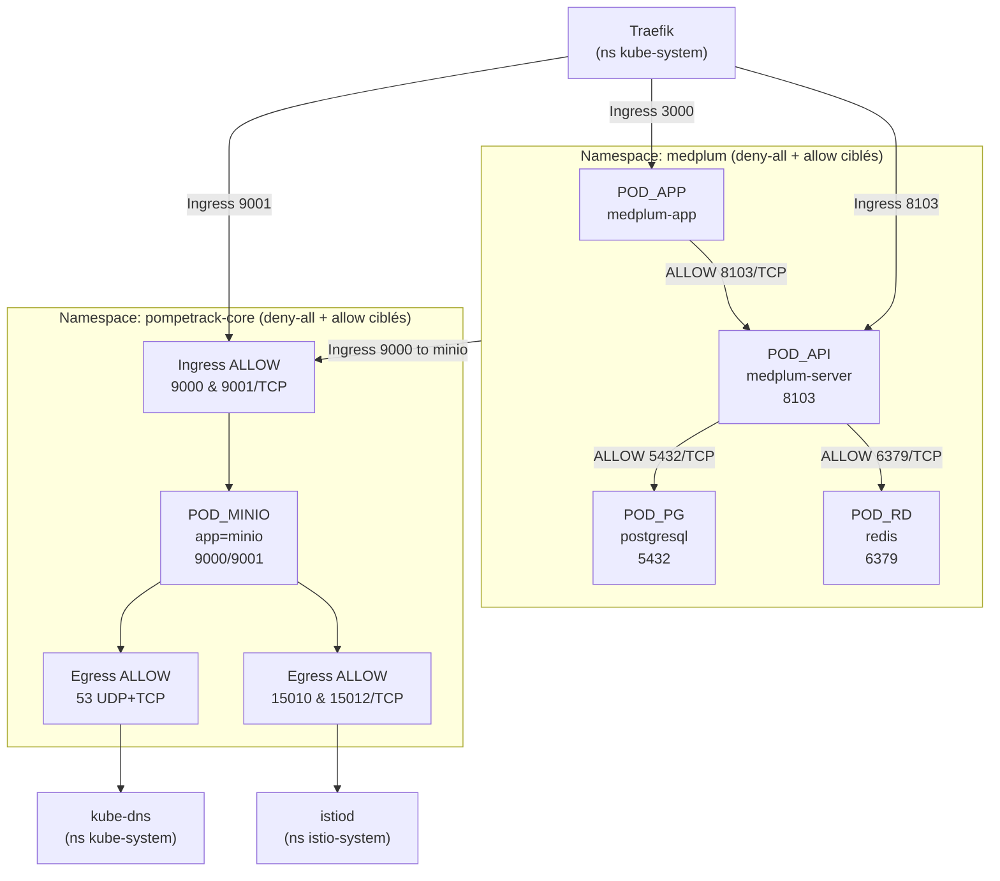

# Page 2 — Sécurité réseau (NetworkPolicies / Calico)

## Légende (commune)

* **U** : client (navigateur)
* **Y** : Yunohost/nginx (TLS termination + SSO)
* **T** : Traefik (K3s, entryPoint `web`, NodePort `31725`)
* **IR_*** : IngressRoute Traefik
* **MW_*** : Middleware Traefik
* **SVC_*** : Service Kubernetes
* **POD_*** : Pod (souvent avec sidecar Istio)

## Ce que tes YAML impliquent

Tu as un **deny-all** dans chaque namespace (`medplum`, `pompetrack-core`) : donc **rien ne passe** sauf ce que les “allow-*” ouvrent explicitement (ingress et/ou egress). (Conceptuellement : “default deny”.) ([Kubernetes][1])

## Diagramme C — Graphe NetPol (flux réellement ouverts)

## Tableau — Ports autorisés (extraits de tes NetworkPolicies)

### Namespace `medplum`

| Source (pods)                                                                            | Destination       |      Port/Proto | Sens                  | Policy                                   |
| ---------------------------------------------------------------------------------------- | ----------------- | --------------: | --------------------- | ---------------------------------------- |
| `kube-system/traefik` → `app=medplum-app`                                                | POD_APP           |        3000/TCP | ingress               | `allow-traefik-to-medplum-app`           |
| `kube-system/traefik` → `app.kubernetes.io/name=medplum`                                 | POD_API           |        8103/TCP | ingress               | `allow-traefik-to-medplum-server`        |
| `app=medplum-app` → `app.kubernetes.io/name=medplum`                                     | POD_APP → POD_API |        8103/TCP | egress                | `allow-egress-app-to-server`             |
| `app=medplum-app` → `app.kubernetes.io/instance=medplum, app.kubernetes.io/name=medplum` | POD_APP → POD_API |        8103/TCP | ingress (sur POD_API) | `allow-app-to-server-ingress`            |
| `app.kubernetes.io/name=medplum` → `app.kubernetes.io/name=postgresql`                   | POD_API → POD_PG  |        5432/TCP | egress                | `allow-medplum-egress-to-postgres-redis` |
| `app.kubernetes.io/name=medplum` → `app.kubernetes.io/name=redis`                        | POD_API → POD_RD  |        6379/TCP | egress                | `allow-medplum-egress-to-postgres-redis` |
| `app.kubernetes.io/name=medplum` → `postgresql`                                          | POD_API → POD_PG  |        5432/TCP | ingress (sur POD_PG)  | `allow-postgres-ingress-from-medplum`    |
| `app.kubernetes.io/name=medplum` → `redis`                                               | POD_API → POD_RD  |        6379/TCP | ingress (sur POD_RD)  | `allow-redis-ingress-from-medplum`       |
| `*` → `kube-system/kube-dns`                                                             | DNS               |      53/UDP+TCP | egress                | `allow-dns-egress`                       |
| `*` → `istio-system/*`                                                                   | istiod            | 15010+15012/TCP | egress                | `allow-egress-to-istiod`                 |

### Namespace `pompetrack-core`

| Source (pods)                             | Destination       |      Port/Proto | Sens    | Policy                           |
| ----------------------------------------- | ----------------- | --------------: | ------- | -------------------------------- |
| `kube-system/traefik` → `app=minio`       | POD_MINIO         |        9001/TCP | ingress | `allow-traefik-to-minio-console` |
| `namespace medplum` → `app=minio`         | POD_* → POD_MINIO |        9000/TCP | ingress | `allow-minio-api-ingress`        |
| `namespace pompetrack-core` → `app=minio` | POD_* → POD_MINIO |        9000/TCP | ingress | `allow-minio-api-ingress`        |
| `*` → `app=minio`                         | POD_* → POD_MINIO |        9000/TCP | egress  | `allow-egress-to-minio-api`      |
| `*` → `kube-system/kube-dns`              | DNS               |      53/UDP+TCP | egress  | `allow-dns-egress`               |
| `*` → `istio-system/*`                    | istiod            | 15010+15012/TCP | egress  | `allow-egress-to-istiod`         |

---