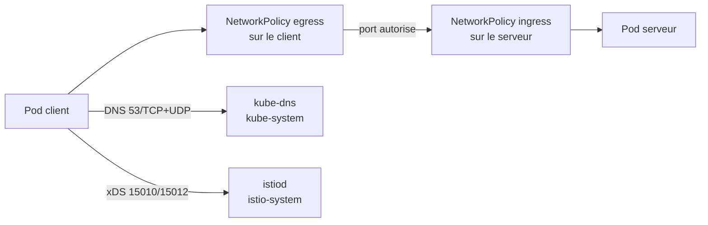
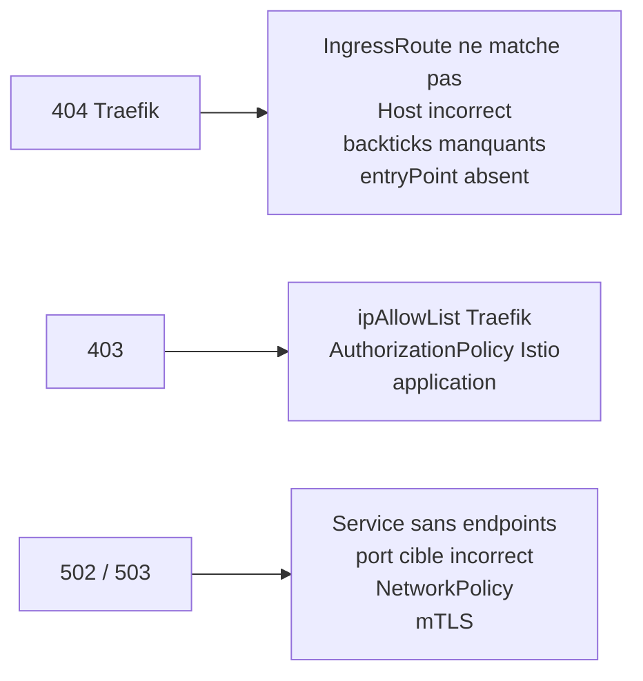
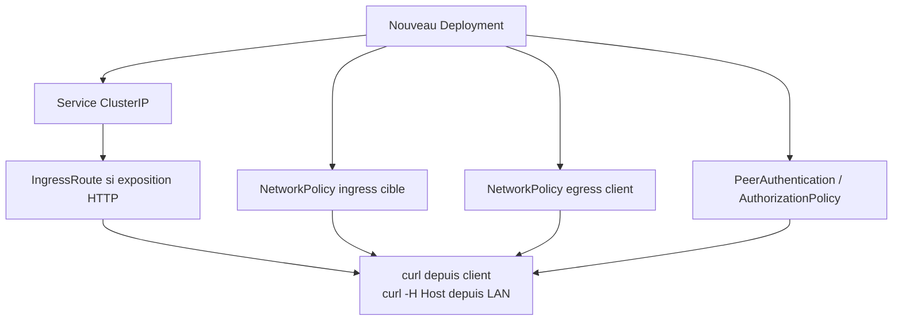

# Architecture Flux 2 - NetworkPolicies / Calico

Ce fichier resume les flux L3/L4 autorises par les NetworkPolicies. Le modele general du cluster est `deny-all` par namespace, puis ouverture explicite des flux utiles.

Les details operatoires sont dans `docs/tips.md`; les chemins HTTP entrants sont dans `docs/routage.md`.

## Modele Mental

Pour un flux applicatif entre deux namespaces, il faut souvent deux autorisations:

1. egress du namespace source vers la cible;
2. ingress du namespace cible depuis la source.

## Graphe Principal

```mermaid
flowchart TB
  traefik["Traefik\nkube-system"]
  dns["kube-dns\nkube-system"]
  istiod["istiod\nistio-system"]
  internet["Internet / APIs externes"]
  ollama["Ollama externe\nLAN"]

  subgraph medplum["medplum\ndeny-all + allow ciblés"]
    med_app["medplum-app"]
    med_api["medplum API"]
    med_provider["medplum-provider"]
    med_pg["PostgreSQL"]
    med_redis["Redis"]
    med_exporters["Postgres / Redis exporters"]
  end

  subgraph core["pompetrack-core\ndeny-all + allow ciblés"]
    ingestion["ingestion"]
    streamlit["streamlit"]
    worker_fhir["worker-fhir"]
    worker_sqlite["worker-sqlite"]
    worker_stream["worker-stream"]
    minio["MinIO API + console"]
    core_pg["PostgreSQL"]
  end

  subgraph airflow["airflow\ndeny-all + allow ciblés"]
    airflow_api["airflow-api-server"]
    airflow_sched["scheduler / dag-processor"]
    airflow_pg["PostgreSQL Airflow"]
  end

  subgraph llm["llm-agent\ndeny-all + allow ciblés"]
    openwebui["open-webui"]
    agent_backend["agent-backend"]
    mcpo["agent-backend-mcpo"]
    telegram["telegram-health-bot"]
    reminders["telegram-reminder-runner"]
    searxng["searxng"]
    qdrant["qdrant"]
  end

  subgraph monitoring["monitoring\ndeny-all + allow ciblés"]
    prometheus["Prometheus"]
    grafana["Grafana"]
    alertmanager["Alertmanager"]
  end

  subgraph backups["pg-backups"]
    backup_jobs["backup CronJobs"]
  end

  traefik -->|"3000"| med_app
  traefik -->|"80/8103 via service"| med_api
  traefik -->|"80"| med_provider
  traefik -->|"8501"| streamlit
  traefik -->|"9001"| minio
  traefik -->|"80"| ingestion
  traefik -->|"8080"| airflow_api
  traefik -->|"80/9090"| grafana
  traefik --> prometheus
  traefik -->|"8080/8000/8501"| openwebui
  traefik --> agent_backend
  traefik --> mcpo

  med_app --> med_api
  med_api --> med_pg
  med_api --> med_redis
  med_provider --> med_api

  ingestion --> minio
  ingestion --> med_api
  streamlit --> worker_stream
  streamlit --> med_api
  streamlit --> internet
  worker_stream --> med_api
  worker_fhir --> med_api
  worker_fhir --> minio
  worker_sqlite --> med_api
  worker_sqlite --> minio

  airflow_sched --> minio
  airflow_sched --> ingestion
  airflow_sched --> med_api
  airflow_api --> airflow_pg
  airflow_sched --> airflow_pg

  openwebui --> internet
  openwebui --> agent_backend
  agent_backend --> med_api
  agent_backend --> ollama
  agent_backend --> qdrant
  agent_backend --> searxng
  mcpo --> agent_backend
  telegram --> agent_backend
  reminders --> agent_backend
  telegram --> internet
  reminders --> internet
  searxng --> internet

  prometheus --> med_exporters
  prometheus --> core_pg
  prometheus --> worker_fhir
  prometheus --> airflow_pg
  prometheus --> grafana
  prometheus --> alertmanager
  alertmanager --> internet

  backup_jobs --> med_pg
  backup_jobs --> core_pg
  backup_jobs --> airflow_pg
  backup_jobs --> minio

  medplum --> dns
  core --> dns
  airflow --> dns
  llm --> dns
  monitoring --> dns
  backups --> dns

  medplum --> istiod
  core --> istiod
  airflow --> istiod
  llm --> istiod
  monitoring --> istiod
  backups --> istiod
```

## Zones A Risque

## Flux A Verifier Quand On Ajoute Un Service

