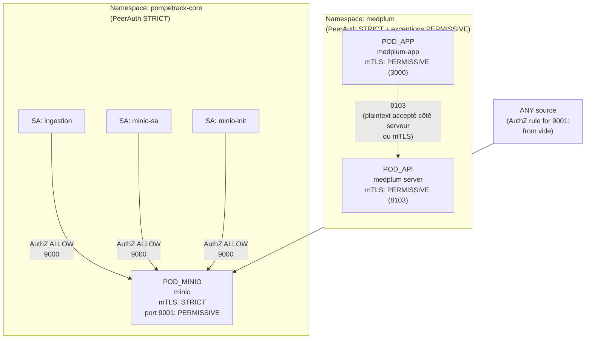

# Page 3 — Sécurité mesh (Istio mTLS + AuthorizationPolicy)

## Légende (commune)

* **U** : client (navigateur)
* **Y** : Yunohost/nginx (TLS termination + SSO)
* **T** : Traefik (K3s, entryPoint `web`, NodePort `31725`)
* **IR_*** : IngressRoute Traefik
* **MW_*** : Middleware Traefik
* **SVC_*** : Service Kubernetes
* **POD_*** : Pod (souvent avec sidecar Istio)

## mTLS (PeerAuthentication) — ce que tu as réellement

* `medplum`: **namespace-wide mTLS STRICT** + exceptions **PERMISSIVE** :

  * `app=medplum-app` : **PERMISSIVE** (portLevelMtls `3000: PERMISSIVE`)
  * `app.kubernetes.io/name=medplum` : **PERMISSIVE** (portLevelMtls `8103: PERMISSIVE`)
* `pompetrack-core`: **namespace-wide mTLS STRICT**

  * `app=minio` : mTLS **STRICT**, avec **port 9001 PERMISSIVE** (console)

Le sens de **PERMISSIVE** : le service accepte **plaintext + mTLS** (utile si un client “hors mesh” doit parler au pod). ([Istio][2])

## AuthorizationPolicy — ce que tu as réellement

* Tu as **une seule AuthorizationPolicy** : sur `pompetrack-core`, `app=minio`

  * **Port 9000** : autorisé **uniquement** depuis ces principals :

    * `cluster.local/ns/pompetrack-core/sa/ingestion`
    * `cluster.local/ns/pompetrack-core/sa/minio-sa`
    * `cluster.local/ns/pompetrack-core/sa/minio-init`
  * **Port 9001** : règle **sans “from”** ⇒ autorise **toutes** les sources (authenticated + unauthenticated) côté Istio. ([Istio][2])
  * MAIS côté exposition réelle, 9001 reste de fait borné par : NetPol (`traefik → 9001`) + middleware Traefik `ipAllowList`.

Aussi important : Istio n’applique un “deny-by-default” **que si** un workload a au moins une policy `ALLOW` (sinon, pas de whitelist). ([Istio][2])

## Diagramme D — Mesh (mTLS + AuthZ)

## Tableau — Principals autorisés (Istio)

### Workload `pompetrack-core/app=minio`

| Port | mTLS (PeerAuth)        | AuthorizationPolicy            | Principals autorisés                                                                              |
| ---: | ---------------------- | ------------------------------ | ------------------------------------------------------------------------------------------------- |
| 9000 | STRICT (namespace)     | **ALLOW restreint**            | `cluster.local/ns/pompetrack-core/sa/ingestion`, `.../sa/minio-sa`, `.../sa/minio-init`           |
| 9001 | PERMISSIVE (portLevel) | **ALLOW “public”** (from vide) | *toutes sources* côté Istio (mais **réellement** limité par NetPol + Traefik MW LAN) ([Istio][2]) |

### Namespace `medplum`

| Workload                         | Port | mTLS (PeerAuth) | AuthorizationPolicy présente ? | Conclusion AuthZ                           |
| -------------------------------- | ---: | --------------- | ------------------------------ | ------------------------------------------ |
| `app=medplum-app`                | 3000 | PERMISSIVE      | non                            | pas de whitelist Istio (dans tes fichiers) |
| `app.kubernetes.io/name=medplum` | 8103 | PERMISSIVE      | non                            | pas de whitelist Istio (dans tes fichiers) |

---
