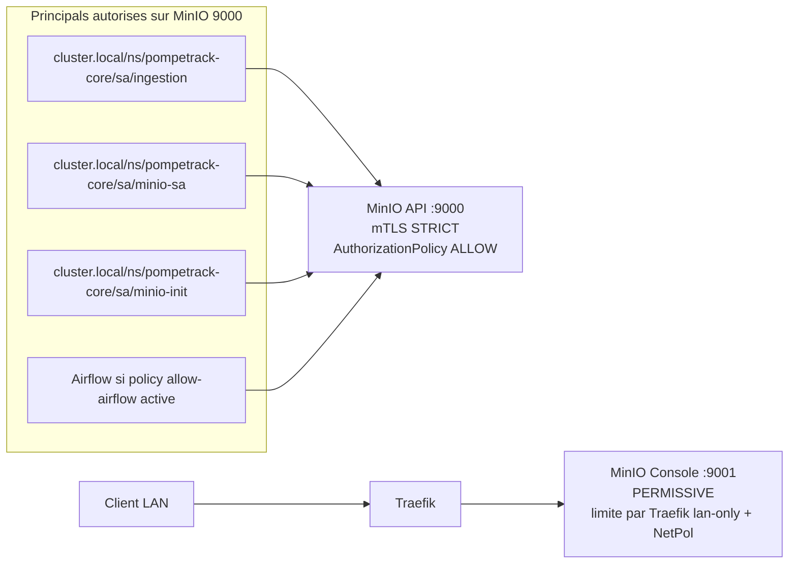
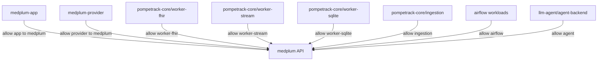
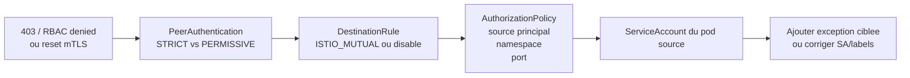

# Architecture Flux 3 - Istio mTLS Et AuthorizationPolicy

Ce fichier montre la couche mesh: injection sidecar, mTLS, exceptions `PERMISSIVE`, `DestinationRule` et `AuthorizationPolicy`.

Les NetworkPolicies restent la couche L3/L4; Istio ajoute une couche identite/service-account et politique applicative.

## Vue Mesh

```mermaid
flowchart TB
  istiod["istiod\nistio-system"]
  traefik["Traefik\nhors mesh applicatif"]

  subgraph medplum["medplum"]
    med_strict["PeerAuthentication namespace\nSTRICT"]
    med_app["medplum-app\nport 3000 PERMISSIVE"]
    med_api["medplum API\nport 8103 PERMISSIVE"]
    med_provider["medplum-provider\nPERMISSIVE"]
    med_pg["PostgreSQL\nmTLS via DR"]
    med_redis["Redis\nmTLS via DR"]
  end

  subgraph core["pompetrack-core"]
    core_strict["PeerAuthentication namespace\nSTRICT"]
    ingestion["ingestion\nPERMISSIVE pour route Traefik"]
    streamlit["streamlit\nPERMISSIVE UI"]
    minio["MinIO\n9000 STRICT + AuthZ\n9001 PERMISSIVE console"]
    workers["workers\nworker-fhir / worker-sqlite / worker-stream"]
  end

  subgraph airflow["airflow"]
    airflow_strict["PeerAuthentication namespace\nSTRICT"]
    airflow_ui["Airflow UI/API\nPERMISSIVE pour Traefik"]
    airflow_internal["scheduler / dag-processor / postgres"]
  end

  subgraph monitoring["monitoring"]
    monitoring_mtls["PeerAuth monitoring\nPERMISSIVE/ajustements admission"]
    prometheus["Prometheus"]
    grafana["Grafana"]
    alertmanager["Alertmanager"]
  end

  subgraph llm["llm-agent"]
    llm_policy["PeerAuth llm-agent"]
    openwebui["open-webui"]
    backend["agent-backend"]
    mcpo["agent-backend-mcpo"]
    telegram["telegram bot / reminder runner"]
  end

  istiod -. "xDS config" .-> medplum
  istiod -. "xDS config" .-> core
  istiod -. "xDS config" .-> airflow
  istiod -. "xDS config" .-> monitoring
  istiod -. "xDS config" .-> llm

  traefik -->|"plaintext HTTP accepte\npar exceptions PERMISSIVE"| med_app
  traefik --> med_api
  traefik --> med_provider
  traefik --> streamlit
  traefik --> ingestion
  traefik --> minio
  traefik --> airflow_ui
  traefik --> grafana
  traefik --> prometheus
  traefik --> openwebui
  traefik --> backend
  traefik --> mcpo

  med_app -->|"mTLS si sidecars"| med_api
  med_api --> med_pg
  med_api --> med_redis
  med_provider --> med_api

  ingestion -->|"S3 API 9000\nprincipal ingestion autorise"| minio
  workers --> med_api
  workers --> minio
  streamlit --> workers
  backend --> med_api
  openwebui --> backend
  openwebui --> mcpo
  telegram --> backend
```

## MinIO AuthZ

## Medplum AuthZ

## Lecture D'Un Blocage Istio

## Principes De Maintenance

1. Un service appele par Traefik doit accepter le trafic provenant de Traefik, souvent via `PERMISSIVE` sur le port HTTP cible.
2. Un flux mesh-to-mesh devrait rester en mTLS strict quand c'est possible.
3. Une `AuthorizationPolicy` `ALLOW` rend le workload restrictif: tout flux non matche est refuse.
4. Les policies doivent viser des identites stables, donc des ServiceAccounts dedies.
5. Toute exception Istio doit etre verifiee avec les NetworkPolicies correspondantes.
