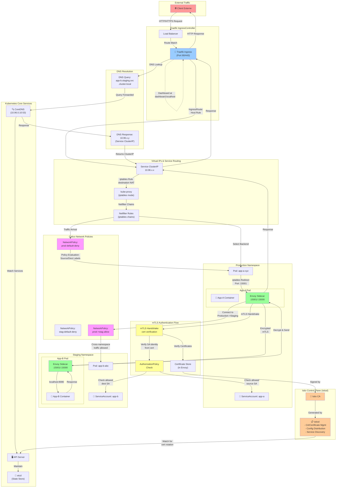

```mermaid

graph TB
    subgraph "External Traffic"
        Client["🌐 Client Externe"]
    end
    
    subgraph "Traefik IngressController"
        Traefik["🚪 Traefik Ingress<br/>(Port 80/443)"]
        TraefikLBL["Load Balancer"]
    end
    
    subgraph "Production Namespace"
        subgraph "App-A Pod"
            AppA["🐳 App-A Container"]
            EnvoyA["Envoy Sidecar<br/>:15001/:15000"]
        end
        SAA["🔑 ServiceAccount: app-a"]
        PodA[Pod: app-a-xyz]
    end
    
    subgraph "Staging Namespace"
        subgraph "App-B Pod"
            AppB["🐳 App-B Container"]
            EnvoyB["Envoy Sidecar<br/>:15001/:15000"]
        end
        SAB["🔑 ServiceAccount: app-b"]
        PodB[Pod: app-b-abc]
    end
    
    subgraph "Calico Network Policies"
        NPProd["NetworkPolicy:<br/>prod-default-deny"]
        NPStag["NetworkPolicy:<br/>stag-default-deny"]
        NPCross["NetworkPolicy:<br/>prod->stag allow"]
    end
    
    subgraph "Istio Control Plane (istiod)"
        Istiod["📋 istiod<br/>- CA/Certificate Mgmt<br/>- Config Distribution<br/>- Service Discovery"]
        CA["🔐 Istio CA"]
    end
    
    subgraph "Kubernetes Core Services"
        ETCD["💾 etcd<br/>(State Store)"]
        APIServer["🖥️ API Server"]
        CoreDNS["🔍 CoreDNS<br/>(10.96.0.10:53)"]
    end
    
    subgraph "Virtual IPs & Service Routing"
        ServiceVIP["Service ClusterIP<br/>10.96.x.x"]
        KubeProxy["kube-proxy<br/>(iptables mode)"]
        IPVS["Netfilter Rules<br/>(iptables chains)"]
    end
    
    subgraph "mTLS Authentication Flow"
        CertStore["Certificate Store<br/>(in Envoy)"]
        mTLSHandshake["mTLS Handshake<br/>cert verification"]
        AuthPolicy["AuthorizationPolicy<br/>Check"]
    end
    
    subgraph "DNS Resolution"
        DNSQuery["DNS Query:<br/>app-b.staging.svc<br/>.cluster.local"]
        DNSResp["DNS Response:<br/>10.96.x.y<br/>(Service ClusterIP)"]
    end
    
    %% External Traffic Flow
    Client -->|HTTP/HTTPS Request| TraefikLBL
    TraefikLBL -->|Route Match| Traefik
    Traefik -->|IngressRoute:<br/>Host Rule| ServiceVIP
    
    %% DNS Resolution
    Traefik -->|DNS Lookup| DNSQuery
    DNSQuery -->|Query Forwarded| CoreDNS
    CoreDNS -->|Watch Services| APIServer
    CoreDNS -->|Response| DNSResp
    DNSResp -->|Returns ClusterIP| ServiceVIP
    
    %% Service Routing with kube-proxy
    ServiceVIP -->|iptables Rule<br/>destination NAT| KubeProxy
    KubeProxy -->|Netfilter Chains| IPVS
    IPVS -->|Select Backend| PodA
    
    %% Pod Destination - Calico Network Policy Check
    IPVS -->|Traffic Arrival| NPProd
    NPProd -->|Policy Evaluation:<br/>Source/Dest Labels| PodA
    
    %% Traffic Enters Envoy Sidecar
    PodA -->|iptables Redirect<br/>Port :15001| EnvoyA
    
    %% Inter-namespace Communication Path
    EnvoyA -->|Connect to<br/>Production->Staging| NPCross
    NPCross -->|Cross-namespace<br/>traffic allowed| PodB
    
    %% mTLS Handshake
    EnvoyA -->|mTLS Handshake| mTLSHandshake
    mTLSHandshake -->|Verify Certificates| CertStore
    CertStore -->|Signed by| CA
    CA -->|Generated by| Istiod
    
    %% Authorization Check
    mTLSHandshake -->|Verify SA identity<br/>from cert| AuthPolicy
    AuthPolicy -->|Check allowed<br/>source SA| SAA
    AuthPolicy -->|Check allowed<br/>dest SA| SAB
    
    %% DNS and ServiceAccount Integration
    APIServer -->|Maintain| ETCD
    Istiod -->|Watch for<br/>cert rotation| APIServer
    
    %% Traefik Dashboard
    Traefik -.->|Dashboard at<br/>dashboard.localhost| Traefik
    
    %% Request to actual container
    EnvoyB -->|localhost:8080| AppB
    
    %% mTLS encrypted connection
    EnvoyA -->|Encrypted<br/>mTLS| EnvoyB
    
    %% Application response
    AppB -->|Response| EnvoyB
    EnvoyB -->|Decrypt & Send| EnvoyA
    EnvoyA -->|Response| ServiceVIP
    ServiceVIP -->|Response| Traefik
    Traefik -->|HTTP Response| Client
    
    style Client fill:#ff9999
    style Traefik fill:#99ccff
    style EnvoyA fill:#99ff99
    style EnvoyB fill:#99ff99
    style Istiod fill:#ffcc99
    style CA fill:#ffcc99
    style NPProd fill:#ff99ff
    style NPCross fill:#ff99ff
    style mTLSHandshake fill:#ffff99
    style AuthPolicy fill:#ffff99


```

