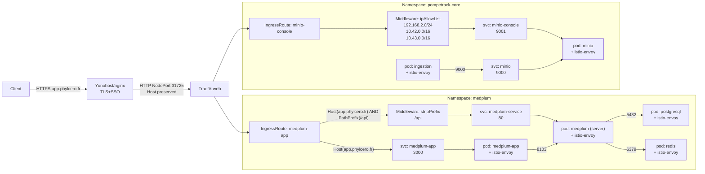

Nickel — avec ça on peut intégrer les **NetworkPolicies** au plan de routage, et pointer les **deux petits “trous logiques”** qui existent (mais qui ne cassent pas chez toi aujourd’hui).

# 1) Ce que tes NetworkPolicies imposent réellement

## A) Namespace `medplum` (deny-all + allow ciblés)

### Base

* `deny-all` (`podSelector: {}`, **Ingress + Egress**)
  → par défaut, **rien ne rentre / rien ne sort** de *tous* les pods `medplum`.

### Egress autorisés (sorties)

1. **DNS** pour tous les pods
   `allow-dns-egress` → vers `kube-system/kube-dns` sur 53 TCP/UDP

2. **Istio control-plane** pour tous les pods
   `allow-egress-to-istiod` → vers namespace `istio-system` sur **15010/15012 TCP**
   (nécessaire pour Envoy ↔ istiod)

3. **medplum-app → medplum (serveur)**
   `allow-egress-app-to-server` (pods `app=medplum-app`) → vers pods `app.kubernetes.io/name=medplum` sur **8103/TCP**

4. **medplum (serveur) → postgres & redis**
   `allow-medplum-egress-to-postgres-redis` (pods `app.kubernetes.io/name=medplum`) →

   * postgres pods `app.kubernetes.io/name=postgresql` sur 5432/TCP
   * redis pods `app.kubernetes.io/name=redis` sur 6379/TCP

### Ingress autorisés (entrées)

1. **medplum-app → medplum (serveur)**
   `allow-app-to-server-ingress` → vers pods `app.kubernetes.io/name=medplum` sur 8103/TCP depuis `app=medplum-app`

2. **Traefik → medplum-app UI**
   `allow-traefik-to-medplum-app` → vers `app=medplum-app` sur 3000/TCP depuis `kube-system` pod `app.kubernetes.io/name=traefik`

3. **Traefik → medplum serveur**
   `allow-traefik-to-medplum-server` → vers `app.kubernetes.io/name=medplum` sur 8103/TCP depuis Traefik

4. **Postgres n’accepte que medplum**
   `allow-postgres-ingress-from-medplum` → vers pods `app.kubernetes.io/name=postgresql` sur 5432/TCP depuis `app.kubernetes.io/name=medplum`

5. **Redis n’accepte que medplum**
   `allow-redis-ingress-from-medplum` → vers pods `app.kubernetes.io/name=redis` sur 6379/TCP depuis `app.kubernetes.io/name=medplum`

### Point critique (trou logique n°1)

Tu as **deux** NetworkPolicies Helm qui “ouvrent” Postgres et Redis bien plus que prévu :

* `medplum-postgresql` : `egress: - {}` (tout ouvert en sortie) + `ingress` port 5432 **sans `from`** (donc **tous les pods du cluster** peuvent entrer sur 5432, malgré deny-all du namespace, car une policy qui sélectionne les pods + ingress sans from = ouvert à tous).
* `medplum-redis` : pareil sur 6379.

👉 Ça contredit tes policies “allow-postgres-ingress-from-medplum” et “allow-redis-ingress-from-medplum”.
**Mais** ça ne casse pas ton fonctionnement (ça le rend juste moins strict que tu crois).

---

## B) Namespace `pompetrack-core` (deny-all + allow ciblés)

### Base

* `deny-all` (Ingress+Egress) pour tous les pods.

### Egress autorisés

1. DNS → kube-dns (53 TCP/UDP)
2. Istiod → istio-system (15010/15012 TCP)
3. **Egress vers MinIO API** (et c’est là que c’est intéressant) :
   `allow-egress-to-minio-api` a `podSelector: {}` → donc **tous les pods** de `pompetrack-core` peuvent aller sur `app=minio` port 9000.

### Ingress autorisés

1. **MinIO API 9000** : `allow-minio-api-ingress`

   * vers pods `app=minio` port 9000
   * depuis **namespace `medplum`** et **namespace `pompetrack-core`** (tous pods de ces namespaces)

2. **Traefik → MinIO console 9001** : `allow-traefik-to-minio-console`

   * vers pods `app=minio` port 9001
   * depuis Traefik (`kube-system` + `app.kubernetes.io/name=traefik`)

### Point critique (trou logique n°2)

`allow-egress-to-minio-api` est appliqué à **tous les pods** du namespace.
Si un jour tu ajoutes d’autres pods dans `pompetrack-core`, ils auront automatiquement le droit d’appeler MinIO API (9000). Peut-être voulu, peut-être non.

---

# 2) Plan de routage bout en bout + NetworkPolicies (version complète)

## Medplum UI (public)

`Client` → `Yunohost/nginx (TLS+SSO)` → `Traefik web :31725`
→ `IngressRoute medplum/medplum-app (Host=app.phylcero.fr)`
→ `svc medplum-app:3000`
→ **NetPol**: autorisé par `allow-traefik-to-medplum-app`
→ `pod medplum-app (+istio-envoy)`

## Medplum API (public)

`Client` → `Yunohost/nginx` → `Traefik :31725`
→ `IngressRoute (Host && PathPrefix /api)` + `stripPrefix(/api)`
→ `svc medplum-service:80` → (endpoints pods `medplum` sur **8103**)
→ **NetPol**: autorisé par `allow-traefik-to-medplum-server`
→ `pod medplum (+istio-envoy)`

## Flux interne Medplum app → server

`pod medplum-app` → `pod medplum` sur 8103
→ **NetPol**: autorisé par `allow-egress-app-to-server` + `allow-app-to-server-ingress`

## Flux interne Medplum server → DB/cache

`pod medplum` → `pod postgresql` 5432 et → `pod redis` 6379
→ **NetPol**: autorisé par `allow-medplum-egress-to-postgres-redis`
→ **Ingress DB/cache**: *voulu* via `allow-*-ingress-from-medplum`, mais *actuellement* DB/cache sont en pratique plus ouverts à cause des netpol Helm (`medplum-postgresql`, `medplum-redis`).

## MinIO console (LAN)

`Client LAN` → `Traefik web`
→ `IngressRoute minio-console (Host=minio.lan)` + middleware `ipAllowList`
→ `svc pompetrack-core-minio-console:9001`
→ **NetPol**: autorisé par `allow-traefik-to-minio-console`
→ `pod minio (+istio-envoy)`

## MinIO API (interne)

`pod ingestion (pompetrack-core)` → `svc pompetrack-core-minio:9000`
→ **NetPol**: autorisé (egress) par `allow-egress-to-minio-api` (tous pods du ns)
→ **Ingress minio**: autorisé depuis namespaces `medplum` et `pompetrack-core` via `allow-minio-api-ingress`

---

# 3) Diagramme Mermaid (avec NetworkPolicies)



---

# 4) Deux ajustements possibles (sans refactor massif)

1. **Rendre Postgres/Redis vraiment “stricts”**

   * Aujourd’hui, les netpol Helm `medplum-postgresql` et `medplum-redis` rendent l’ingress trop permissif.
   * Solution propre : désactiver/overrider ces netpol Helm, ou les remplacer par des versions “from medplum only”.

2. **Restreindre l’egress vers MinIO API**

   * Si tu veux que *seuls* `ingestion` (et éventuellement d’autres pods précis) puissent appeler MinIO, alors `allow-egress-to-minio-api` ne devrait pas être `podSelector: {}`.

---

# Étape suivante (tests minimaux “strict mais fonctionnel”)

Je te propose **2 tests seulement** :

### Test A — depuis `medplum-app` : API interne OK (8103)

```bash
kubectl -n medplum exec deploy/medplum-app -c medplum-app -- sh -lc 'wget -qO- http://medplum-service/healthcheck || true'
```

### Test B — depuis un pod “neutre” dans un autre namespace : DB doit être bloquée (si on veut strict)

On crée un pod temporaire dans `default` (ou autre ns) et on tente d’atteindre postgres.

```bash
kubectl run np-test -n default --rm -i --restart=Never --image=busybox -- sh -lc 'nc -vz -w2 medplum-postgresql.medplum.svc 5432 || true'
```

Mais avant de lancer ces tests, dis-moi juste : tu veux que **postgres/redis soient inaccessibles depuis tout sauf medplum**, oui/non ?
(Si oui, on corrige d’abord les 2 netpol Helm permissives, sinon le test B ne sera pas concluant.)
