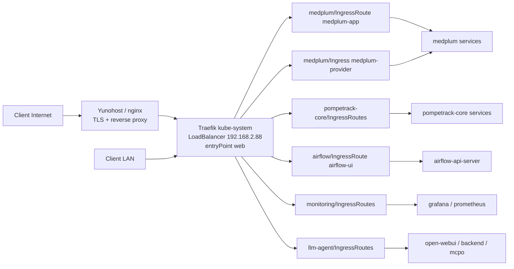
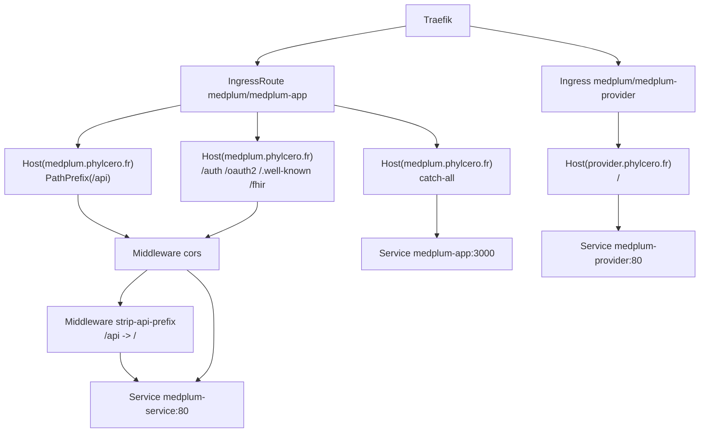

# Routage PompeTrack K3s

Ce document decrit le routage HTTP entrant du cluster: client, Yunohost si present, Traefik, IngressRoute ou Ingress Kubernetes, Service, Istio, puis pod applicatif.

Il complete `docs/tips.md`: ici on explique le chemin reseau, alors que `tips.md` garde les commandes de debug rapides.

## Vue d'ensemble

Traefik est le point d'entree HTTP du cluster K3s.

```text
Client LAN ou Internet
  -> Yunohost/nginx si domaine public
  -> Traefik kube-system
  -> IngressRoute ou Ingress
  -> Service Kubernetes
  -> pod applicatif, souvent avec sidecar istio-proxy
```

Etat Traefik observe:

```text
Service: kube-system/traefik
Type: LoadBalancer
IP LAN: 192.168.2.88
entryPoint web: port 80, nodePort 32110
entryPoint websecure: port 443, nodePort 31350
entryPoint metrics: port 8082, nodePort 32491
```

Les routes publiques passent en general par Yunohost/nginx, qui termine TLS et reverse-proxy vers Traefik. Les routes LAN attaquent directement Traefik sur `http://192.168.2.88/` avec un `Host` specifique.

## Inventaire des routes

Routes publiques:

| Host | Namespace | Objet | Match | Service cible |
| --- | --- | --- | --- | --- |
| `medplum.phylcero.fr` | `medplum` | `IngressRoute/medplum-app` | `/api` | `medplum-service:80`, avec `strip-api-prefix` |
| `medplum.phylcero.fr` | `medplum` | `IngressRoute/medplum-app` | `/auth`, `/oauth2`, `/.well-known`, `/fhir` | `medplum-service:80` |
| `medplum.phylcero.fr` | `medplum` | `IngressRoute/medplum-app` | catch-all | `medplum-app:3000` |
| `provider.phylcero.fr` | `medplum` | `Ingress/medplum-provider` | `/` | `medplum-provider:80` |

Routes LAN:

| Host | Namespace | Objet | Service cible | Middleware |
| --- | --- | --- | --- | --- |
| `streamlit.lan`, `192.168.2.88.nip.io` | `pompetrack-core` | `IngressRoute/streamlit-ui` | `pompetrack-core-streamlit-ui:8501` | `lan-only` |
| `minio.lan` | `pompetrack-core` | `IngressRoute/minio-console` | `pompetrack-core-minio-console:9001` | `lan-only` |
| `ingestion.lan` + `/ingest/strength` | `pompetrack-core` | `IngressRoute/ingestion-strength-public` | `ingestion:80` | aucun |
| `ingestion.lan` + `/ingest/iphone_api` | `pompetrack-core` | `IngressRoute/ingestion-iphone-public` | `ingestion:80` | aucun |
| `airflow.lan` | `airflow` | `IngressRoute/airflow-ui` | `airflow-api-server:8080` | `lan-only` |
| `grafana.lan` | `monitoring` | `IngressRoute/grafana` | `monitoring-grafana:80` | `lan-only` |
| `prometheus.lan` | `monitoring` | `IngressRoute/prometheus` | `prometheus-prometheus:9090` | `lan-only` |
| `streamlit-agent-llm.lan`, `llm-agent.192.168.2.88.nip.io` | `llm-agent` | `IngressRoute/streamlit-ui-lan` | `streamlit-agent-llm:8501` | `lan-only` |
| `open-webui.lan`, `open-webui.192.168.2.88.nip.io` | `llm-agent` | `IngressRoute/open-webui-lan` | `open-webui:8080` | `lan-only` |
| `agent-tools.lan`, `agent-tools.192.168.2.88.nip.io` | `llm-agent` | `IngressRoute/agent-backend-mcpo-lan` | `agent-backend-mcpo:8000` | `lan-only` |
| `agent-backend.lan`, `agent-backend.192.168.2.88.nip.io` | `llm-agent` | `IngressRoute/agent-backend-lan` | `agent-backend:8000` | `lan-only` |

Anomalie a verifier:

```text
deploy/namespaces/llm-agent/ingress/04-searxng-web-ingressroute.yaml
```

Le manifest s'appelle `searxng-web`, mais son match pointe vers `Host(ingestion.lan) && PathPrefix(/ingest/strength)` et son backend vers le service `ingestion:80`, qui n'existe pas dans `llm-agent`. Cela ressemble a un copier-coller. La route apparait comme objet actif, mais elle ne documente probablement pas SearxNG.

## Middlewares LAN

Les UIs internes utilisent des middlewares `lan-only` Traefik avec `ipAllowList`.

`pompetrack-core` et `llm-agent` autorisent:

```text
192.168.2.0/24
192.168.3.0/24
10.42.0.0/16
10.43.0.0/16
82.65.187.211
```

`airflow` autorise:

```text
192.168.2.0/24
10.42.0.0/16
10.43.0.0/16
```

`monitoring` autorise:

```text
192.168.2.0/24
10.42.0.0/16
10.43.0.0/16
192.168.0.0/16
```

Ces allowlists sont appliquees par Traefik, avant le Service Kubernetes. Elles ne remplacent pas les NetworkPolicies: il faut aussi que le namespace autorise le flux Traefik -> pod cible.

## Chemins bout en bout

### Medplum UI

```text
Client HTTPS
  -> Yunohost/nginx pour medplum.phylcero.fr
  -> Traefik entryPoint web
  -> IngressRoute medplum/medplum-app
  -> route Host(medplum.phylcero.fr)
  -> Service medplum-app:3000
  -> pod medplum-app
```

Cette route sert l'application web et les assets.

Test:

```bash
curl -sS -o /tmp/medplum-ui.out -w '%{http_code} %{content_type}\n' https://medplum.phylcero.fr/
```

### Medplum API

```text
Client HTTPS /api/*
  -> Yunohost/nginx pour medplum.phylcero.fr
  -> Traefik entryPoint web
  -> IngressRoute medplum/medplum-app
  -> route Host(medplum.phylcero.fr) && PathPrefix(/api)
  -> Middleware cors
  -> Middleware strip-api-prefix
  -> Service medplum-service:80
  -> pod Medplum API
```

Le middleware `strip-api-prefix` transforme par exemple:

```text
/api/healthcheck -> /healthcheck
```

Les chemins `/auth`, `/oauth2`, `/.well-known` et `/fhir` vont aussi vers `medplum-service:80`, mais sans stripping de prefixe.

Test:

```bash
curl -sS https://medplum.phylcero.fr/api/healthcheck
curl -sS https://medplum.phylcero.fr/fhir/metadata
```

### Medplum provider

```text
Client HTTPS
  -> Yunohost/nginx pour provider.phylcero.fr
  -> Traefik
  -> Ingress Kubernetes medplum/medplum-provider
  -> Service medplum-provider:80
  -> pod medplum-provider
```

Ici l'objet est un `Ingress` Kubernetes standard, pas un `IngressRoute`.

### pompetrack-core UI

```text
Client LAN
  -> http://streamlit.lan/ ou http://192.168.2.88.nip.io/
  -> Traefik entryPoint web
  -> IngressRoute pompetrack-core/streamlit-ui
  -> Middleware lan-only
  -> Service pompetrack-core-streamlit-ui:8501
  -> pod streamlit
```

Test:

```bash
curl -sS -o /tmp/streamlit.out -w '%{http_code} %{content_type}\n' \
  -H 'Host: streamlit.lan' http://192.168.2.88/
```

### MinIO console

```text
Client LAN
  -> http://minio.lan/
  -> Traefik entryPoint web
  -> IngressRoute pompetrack-core/minio-console
  -> Middleware lan-only
  -> Service pompetrack-core-minio-console:9001
  -> pod minio
```

Test:

```bash
curl -sS -o /tmp/minio.out -w '%{http_code} %{content_type}\n' \
  -H 'Host: minio.lan' http://192.168.2.88/
```

### Ingestion publique LAN

```text
Client LAN ou integration
  -> http://ingestion.lan/ingest/strength
  -> Traefik entryPoint web
  -> IngressRoute pompetrack-core/ingestion-strength-public
  -> Service ingestion:80
  -> pod ingestion
```

```text
Client LAN ou integration
  -> http://ingestion.lan/ingest/iphone_api
  -> Traefik entryPoint web
  -> IngressRoute pompetrack-core/ingestion-iphone-public
  -> Service ingestion:80
  -> pod ingestion
```

Ces deux routes n'ont pas de middleware `lan-only` dans les manifests actuels. Le filtrage repose donc sur DNS/reseau amont, NetworkPolicy et eventuelles protections applicatives.

### Airflow UI

```text
Client LAN
  -> http://airflow.lan/
  -> Traefik entryPoint web
  -> IngressRoute airflow/airflow-ui
  -> Middleware lan-only
  -> Service airflow-api-server:8080
  -> pod Airflow API server
```

### Monitoring

```text
Client LAN
  -> http://grafana.lan/
  -> Traefik entryPoint web
  -> IngressRoute monitoring/grafana
  -> Middleware lan-only
  -> Service monitoring-grafana:80
  -> pod Grafana
```

```text
Client LAN
  -> http://prometheus.lan/
  -> Traefik entryPoint web
  -> IngressRoute monitoring/prometheus
  -> Middleware lan-only
  -> Service prometheus-prometheus:9090
  -> pod Prometheus
```

### llm-agent

Open WebUI:

```text
Client LAN
  -> http://open-webui.lan/
  -> Traefik entryPoint web
  -> IngressRoute llm-agent/open-webui-lan
  -> Middleware lan-only
  -> Service open-webui:8080
  -> pod open-webui
```

Agent backend OpenAI-compatible:

```text
Client LAN ou Open WebUI
  -> http://agent-backend.lan/ ou http://agent-backend.192.168.2.88.nip.io/
  -> Traefik entryPoint web
  -> IngressRoute llm-agent/agent-backend-lan
  -> Middleware lan-only
  -> Service agent-backend:8000
  -> pod agent-backend
```

Tools OpenAPI / MCPO:

```text
Client LAN ou Open WebUI
  -> http://agent-tools.lan/ ou http://agent-tools.192.168.2.88.nip.io/
  -> Traefik entryPoint web
  -> IngressRoute llm-agent/agent-backend-mcpo-lan
  -> Middleware lan-only
  -> Service agent-backend-mcpo:8000
  -> pod agent-backend-mcpo
```

Streamlit agent:

```text
Client LAN
  -> http://streamlit-agent-llm.lan/ ou http://llm-agent.192.168.2.88.nip.io/
  -> Traefik entryPoint web
  -> IngressRoute llm-agent/streamlit-ui-lan
  -> Middleware lan-only
  -> Service streamlit-agent-llm:8501
  -> pod streamlit-agent-llm
```

## Ordre de resolution d'une requete

Pour une requete entrante, les couches a verifier sont:

1. DNS ou fichier hosts: le host pointe-t-il vers Yunohost ou `192.168.2.88` selon le cas ?
2. Reverse proxy externe: Yunohost/nginx garde-t-il le bon `Host` ?
3. Traefik: l'objet `IngressRoute` ou `Ingress` existe-t-il et matche-t-il ?
4. Middleware: l'IP source passe-t-elle l'allowlist ?
5. Service Kubernetes: le Service a-t-il des endpoints ?
6. NetworkPolicy: Traefik peut-il joindre les pods cibles ?
7. Istio: mTLS/AuthorizationPolicy accepte-t-il le flux ?
8. Application: le pod repond-il correctement au chemin demande ?

Un `404` Traefik indique souvent que la route ne matche pas: host incorrect, backticks manquants dans `Host(...)`, mauvais entryPoint, ou objet CRD non pris en compte.

Un `403` peut venir d'un middleware `ipAllowList`, d'Istio AuthorizationPolicy ou de l'application.

Un `502/503` indique souvent que Traefik a matche la route mais ne peut pas atteindre un endpoint valide: Service sans endpoint, port incorrect, NetworkPolicy ou mTLS.

## Commandes de debug

Lister toutes les routes:

```bash
kubectl get ingressroute -A
kubectl get ingress -A
```

Afficher une route precise:

```bash
kubectl -n medplum get ingressroute medplum-app -o yaml
kubectl -n pompetrack-core get ingressroute streamlit-ui -o yaml
kubectl -n llm-agent get ingressroute open-webui-lan -o yaml
```

Verifier le Service Traefik:

```bash
kubectl -n kube-system get svc traefik -o wide
kubectl -n kube-system logs deploy/traefik --tail=160
```

Tester une route sans dependre du DNS local:

```bash
curl -sS -o /tmp/open-webui.out -w '%{http_code} %{content_type}\n' \
  -H 'Host: open-webui.lan' http://192.168.2.88/

curl -sS -o /tmp/agent-backend.out -w '%{http_code} %{content_type}\n' \
  -H 'Host: agent-backend.lan' http://192.168.2.88/health

curl -sS -o /tmp/grafana.out -w '%{http_code} %{content_type}\n' \
  -H 'Host: grafana.lan' http://192.168.2.88/
```

Verifier les endpoints:

```bash
kubectl -n llm-agent get svc,endpoints open-webui agent-backend agent-backend-mcpo
kubectl -n medplum get svc,endpoints medplum-app medplum-service medplum-provider
kubectl -n pompetrack-core get svc,endpoints pompetrack-core-streamlit-ui pompetrack-core-minio-console ingestion
```

Verifier les policies qui autorisent Traefik:

```bash
kubectl -n medplum get netpol | rg 'traefik|medplum'
kubectl -n pompetrack-core get netpol | rg 'traefik|streamlit|minio|ingestion'
kubectl -n llm-agent get netpol | rg 'traefik|open-webui|agent'
kubectl -n airflow get netpol | rg 'traefik|airflow'
kubectl -n monitoring get netpol | rg 'traefik|grafana|prometheus'
```

Verifier Istio sur le pod cible:

```bash
NS=llm-agent
POD=$(kubectl -n "$NS" get pod -l app=open-webui -o jsonpath='{.items[0].metadata.name}')
kubectl -n "$NS" get pod "$POD" -o jsonpath='{.spec.containers[*].name}{"\n"}'
kubectl -n "$NS" describe pod "$POD" | egrep -n 'istio|envoy|proxy|sidecar' || true
```

## Diagramme global



## Diagramme Medplum



## Notes de maintenance

Quand une nouvelle route est ajoutee:

1. Ajouter le `IngressRoute` ou `Ingress`.
2. Ajouter un middleware `lan-only` si la route ne doit pas etre publique.
3. Verifier que le Service cible expose le bon port.
4. Ajouter ou ajuster la NetworkPolicy Traefik -> pod cible.
5. Verifier Istio si le namespace est dans le mesh.
6. Tester avec `curl -H 'Host: ...' http://192.168.2.88/...`.
7. Ajouter la route dans l'inventaire de ce fichier.
