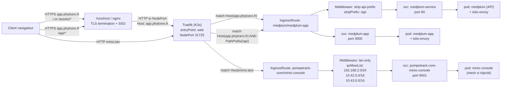
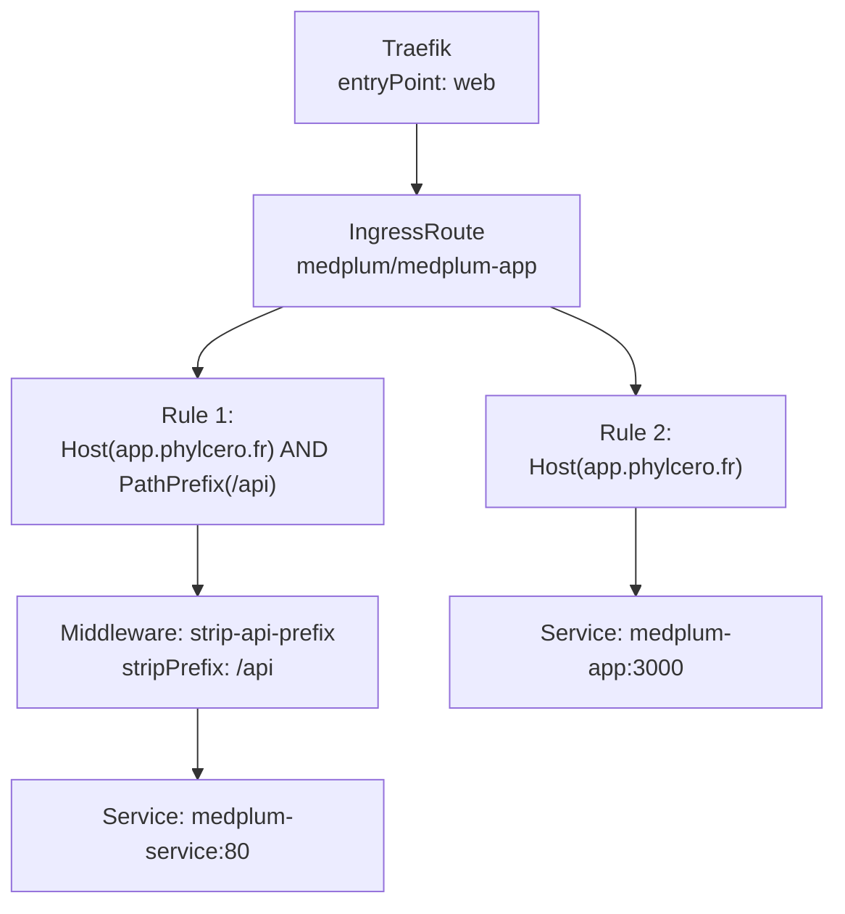

# Plan de routage bout en bout

## A) Medplum public — Host `app.phylcero.fr`

### A1) UI / assets

**Entrée :** `https://app.phylcero.fr/` (et `/assets/*`)

1. **Client (navigateur)**
2. **Yunohost / nginx**

   * termine TLS (HTTP/2 côté client)
   * SSO (header observé : `x-sso-wat: You've just been SSOed`)
   * reverse proxy vers Traefik en interne (NodePort)
3. **Traefik (K3s, kube-system)**

   * entryPoint : `web` (port 80) → NodePort `192.168.2.88:31725`
   * provider : `kubernetescrd`
   * ressource : `IngressRoute` `medplum/medplum-app`
   * règle : `Host(\`app.phylcero.fr`)` (route “catch-all”)
   * backend : Service `medplum-app` port `3000`
4. **Service K8s** `medplum-app.medplum.svc.cluster.local:3000`
5. **Istio data plane (Envoy)** sur le pod (réponse observée `Server: istio-envoy`)
6. **Pod** `medplum-app` → réponse HTML/JS/CSS

✅ Preuve observée : `X-Envoy-Decorator-Operation: medplum-app.medplum.svc.cluster.local:3000/*` et HTTP 200.

---

### A2) API

**Entrée :** `https://app.phylcero.fr/api/...` (ex: `/api/healthcheck`)

1. **Client**
2. **Yunohost / nginx** (TLS + SSO) → reverse proxy vers Traefik
3. **Traefik** (`web` / NodePort 31725)
4. **IngressRoute** `medplum/medplum-app`, route prioritaire :

   * match : `Host(\`app.phylcero.fr`) && PathPrefix(`/api`)`
   * middleware : `strip-api-prefix`

     * config : `stripPrefix.prefixes: ["/api"]`
   * backend : Service `medplum-service` port `80`
5. **Réécriture de chemin**

   * requête client `/api/healthcheck`
   * devient `/healthcheck` côté backend `medplum-service:80`
6. **Service K8s** `medplum-service.medplum.svc.cluster.local:80`
7. **Istio data plane (Envoy)** → pod API Medplum
8. **Pod** Medplum API → JSON 200

✅ Preuve observée : `X-Envoy-Decorator-Operation: medplum-service.medplum.svc.cluster.local:80/*` et HTTP 200.

---

## B) MinIO console (LAN) — Host `minio.lan`

**Entrée :** `http://minio.lan/` (via DNS/hosts LAN)

1. **Client LAN**
2. **Traefik** (`web` port 80 / NodePort 31725 selon ton accès)
3. **IngressRoute** `pompetrack-core/minio-console`

   * match : `Host(\`minio.lan`)`
   * middleware : `lan-only`

     * `ipAllowList.sourceRange` :

       * `192.168.2.0/24` (LAN)
       * `10.42.0.0/16` (Pods K3s)
       * `10.43.0.0/16` (Services K3s)
   * backend : service `pompetrack-core-minio-console` port `9001`
4. **Service K8s** `pompetrack-core-minio-console.pompetrack-core.svc.cluster.local:9001`
5. (Potentiellement Envoy si pod dans mesh) → console MinIO

✅ Ici, le contrôle d’accès réseau est fait au niveau Traefik middleware (IP allowlist).

---

# Diagramme texte (propre, “lecture rapide”)

**Medplum UI**
`Client` → `Yunohost/nginx (TLS+SSO)` → `Traefik web :31725 (Host=app.phylcero.fr)` → `IngressRoute medplum-app (Host match)` → `svc medplum-app:3000` → `istio-envoy` → `pod medplum-app`

**Medplum API**
`Client` → `Yunohost/nginx (TLS+SSO)` → `Traefik web :31725 (Host=app.phylcero.fr)` → `IngressRoute medplum-app (Host && PathPrefix /api)` → `Middleware stripPrefix(/api)` → `svc medplum-service:80` → `istio-envoy` → `pod medplum API`

**MinIO console LAN**
`Client LAN (IP ∈ allowlist)` → `Traefik web` → `IngressRoute minio-console (Host=minio.lan)` → `Middleware ipAllowList(192.168.2.0/24,10.42/16,10.43/16)` → `svc pompetrack-core-minio-console:9001` → `pod console`

---

# Diagramme Mermaid

## 1) Vue “bout en bout” (global)

## 2) Zoom Medplum (routes Traefik)

---
